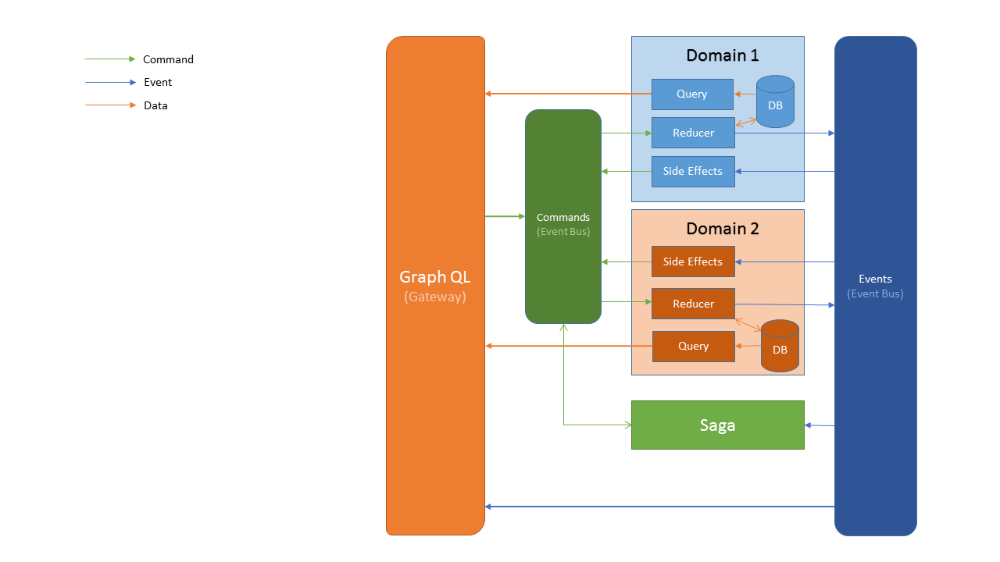

# Idea
After using GraphQL, I decided to re-think current architecture and connect it with different ideas like CQRS & Event Sourcing.
Its an experimental architecture, if you are here, that means that you have simillar idea and thats great! Here you will find diagram (big picture) how it should work in theory and implementation also.

# "Big Picture"

